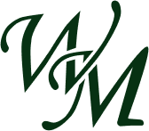
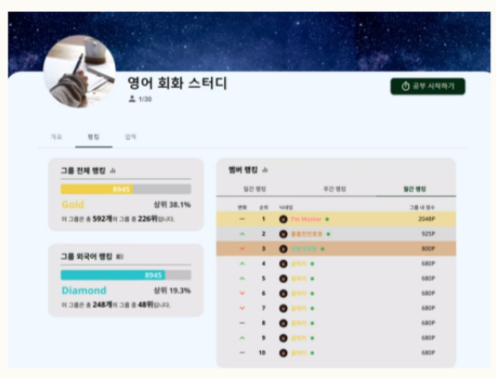
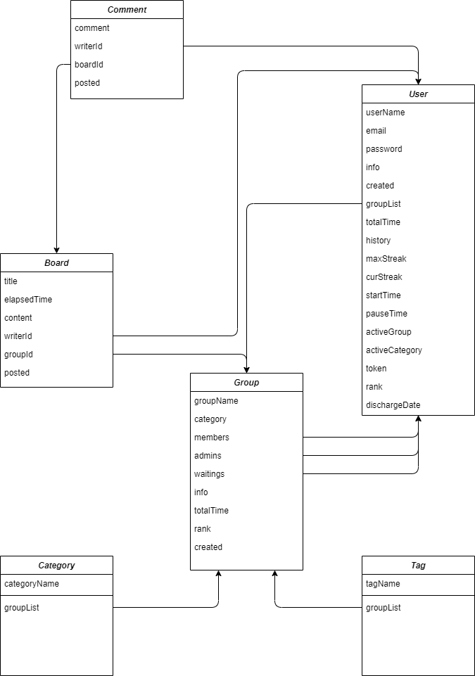

# 위드 밀리터리

## 프로젝트 소개

- 군대에서도 함께 !
- 공동의 목표를 가진 스터디 그룹에서
  하루를 기록하고, 소통하고, 경쟁하며 자기개발하자 !
- 함께 목표를 향해 나아가 그룹의 랭킹도 상승시키자 !
- 내가 얼마나 자기개발을 열심히 했는지 각종 랭킹으로 알아보자 !

## temp 팀 소개

김건우 | [gonudayo](https://github.com/gonudayo)

- 팀장
- 백엔드 개발 담당

김별찬 | [algoORgoal](https://github.com/algoORgoal)

- 프론트 개발 담당
- 개발 컨벤션 관리 및 개발 문서 제작

나승호 | [Seungho-Na](https://github.com/Seungho-Na)

- 프론트 개발 담당
- 시연 영상 제작

임성준 | [SungjunIm](https://github.com/SungjunIm)

- 백엔드 개발 담당
- 발표 자료 제작

정준호 | [cak101435](https://github.com/cak101435)

- 디자인 담당
- 시연 영상 제작 및 발표 자료 제작

## 개발 배경

[노션](https://gonudayo.notion.site/10b27d5f75b441fd840340911c97154f)

## 프로젝트 설명

|  |  |
| --------------------------- | --------------------- |
| 그룹 생성 및 가입           | 활동 UI 제공          |

|  |  |
| ------------------------- | --------------------------- |
| 랭킹 시스템               | 게시판 작성                 |

## 기대효과

- 스터디그룹에 속하며 함께 성장해가는 기회
- 타이머 및 랭킹시스템을 통한 자기주도적 학습
- 학습자료 공유 및 자기개발 내용 공유

## 데이터베이스 ERD

## 컴퓨터 구성 / 필수 조건 안내 (Prerequisites)

- ECMAScript 6 지원 브라우저 사용
- 권장: Google Chrome 버젼 77 이상

## 기술 스택 (Technique Used)

### Server(backend)

- 
- 
- 
- mongoose
- 

### Client(frontend)

- 
- 
- 
- 
- 
- 

### 디자인 & 협업툴

- 
- 
- 
- 

## 프로젝트 사용법 (Getting Started)

0. 노드를 14.17.6 버전으로 세팅한다. [(참고)](https://velog.io/@gonudayo/ubuntu-%ED%99%98%EA%B2%BD%EC%97%90-node.js-%EC%B4%88%EA%B0%84%EB%8B%A8-%EC%84%B8%ED%8C%85)
1. server 디렉토리로 이동해 npm install
2. client 디렉토리로 이동해 npm install
3. server 디렉토리에 .env 파일 생성
   - MONGO_URI="" 그리고 JWT_SECRET="" 을 입력해준다.
4. server 디렉토리에서 npm run dev로 앱을 실행한다.

## 저작권 및 사용권 정보 (Copyleft / End User License)

- [MIT](https://github.com/osamhack2021/Web_With_Military_temp/blob/master/license.md)

This project is licensed under the terms of the MIT license.
