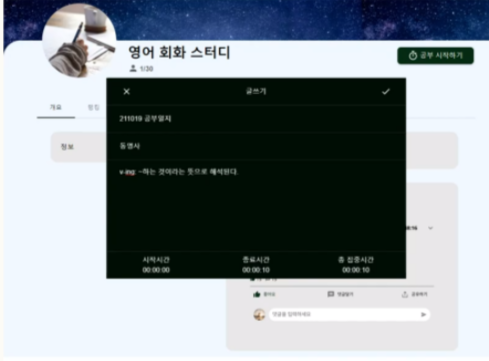

# 위드밀리터리


## 프로젝트 소개

- 혼자 공부하지말고, 공동의 목표를 가진 스터디그룹에서
  하루를 기록하고, 소통하고, 경쟁하며 자기개발하자 !
- 함께 목표를 향해 나아가 그룹의 랭킹도 상승시키자 !
- 내가 얼마나 자기개발을 열심히 했는지 각종 랭킹으로 알아보자 !

- 발표자료 / 데모

## 팀 소개

김건우 / Github Id: [gonudayo](https://github.com/gonudayo)

- 백엔드 부분 개발 진행을 관리 및 리드한다.
- 비즈니스 발전을 위한 전략을 기획한다.

김별찬 / Github Id: [algoORgoal](https://github.com/algoORgoal)</summary>

- 깃 허브 저장소 관리 및 개발 문서를 제작한다.
- 프론트 부분 개발을 보조한다.

나승호 / Github Id: [Seungho-Na](https://github.com/Seungho-Na)

- 프론트 부분 개발 진행을 관리 및 리드한다.
- 커뮤니티 발전을 위한 전략을 기획한다.

임성준 / Github Id: [SungjunIm](https://github.com/SungjunIm)

- 백엔드 부분 개발 진행을 관리 및 리드한다.
- 깃 허브 저장소 관리 및 개발 문서를 제작한다.

정준호 / Github Id: [cak101435](https://github.com/cak101435)

- 프로젝트의 디자인, 구성, 기능 등 전반적인 독창성을 보장한다.

## 개발 배경

<details>
<summary>팀의 위드밀리터리 개발 동기</summary>
<br>
시간을 거슬러 올라가 훈련소 시절로 돌아가 본다. 대책 없이 군대에 갔다. 내가 선택해서 들어갔지만, 군대를 안 가고 사회에서 직장 생활하는 친구들, 대학생활하는 친구들을 보고 있자니 여기 갇혀있는 시간이 너무 아까워 1분 1초가 괴롭게 느껴졌다. 게다가 자유도 제약당하고, 하기 싫은 일을 강요당하니 속 깊은 곳부터 끓어오르는 불편함을 견딜 수가 없었다. 계속 원망만 했다. 동시에 억울하지 않기 위해 나름대로 합리화 방법을 강구했다. 18개월이라는 긴 기간 동안 원하는 바를 이룬다면, 덜 억울하지 않을까 해서.
대한민국에 태어난 건 선택이 아니었지만, 떠나지 않은 건 오로지 본인의 선택이다. 사회의 혜택을 받았고, 그에 대한 약속을 지키기 위해 군대에 왔다. 병역 특례나 공익을 받기 위한 노력을 하지 않은 것도 본인의 선택이었다. 그래서 군대에 왔다면, 허송세월 낭비할 게 아니라 공생할 방법을 찾아야 한다. 밖이라고 자유롭기만 할까 온갖 유혹에 자유롭지 못한 게 현실이다. 군대와 함께 내가 목표한 바를 해낸다. '위드 밀리터리'의 시작이었다.
약 9개월 전부터 매일매일 사지방에 내려가서 프로그래밍 공부를 하였다. 그러나 쉽게 무너지는 집중력과 금방 바닥나 버리는 의지 때문에 허탕치고 돌아오는 게 하루 이틀이 아니었다. 필요성을 온몸으로 느끼고 타당성 검토까지 끝난 마당에 온갖 핑계로 자기 합리화를 한다. 작심삼일, 냄비근성 등 상태 파악을 하며 자신을 질책해도, 돌아서면 변한 게 없다. 나도 그렇듯, 누구나 그렇다. 그러나 나는 달라졌다. 'solved.ac'를 이용하면서부터 지금까지의 노력이 수치화되어 시각적으로 볼 수 있었다. 돌아보면 열심히 했던 흔적이 남으니 매일매일 뿌듯할 수 있기 때문이다. 나중에는 최장 스트릭이라는 기능이 도입되었다. 이는 매일매일 끊기지 않고 얼마나 오래 하는지 기록하는 지표로, 깃허브 잔디심기와 같은 그래프랑 연계하여 더욱더 자기개발에 몰입할 수 있게 하였다. 운 좋게도 상위에 랭크 하게 되어, 유지하기 위해 물불 안 가리고 노력을 하고 있다. 나중에는 자기개발을 위해 공부하는 것인지, 최장 스트릭 및 공부 히스토리를 위하여 공부하는 것 인지 그 경계가 모호해진 순간이 왔다. 그러나 행위 자체로 의미 있다고 생각한다. 매일매일 무슨 일이 일어나더라도 끊기지 않고 자기개발 행위를 한다는 것이 큰 의미이다. 궤도에 올라선 순간 무한한 발전을 꿈꿀 수 있다. 삶이 끝없이 보람차면서, 동시에 하루하루 시간이 너무 빨리 가는 느낌이 들어, 하루가 지날 때마다 아쉬운 기분이 든다. 나는 군대에 있지만 이런 생각을 한다는 것이다. 시간이 흘러 전역하고 뒤돌아본다면 정말 알차고 뿌듯한 군 생활이었다고 말할 수 있다. 주특기를 잘하고, 일을 잘해서가 아니라, 군대에 와서도 나의 인생을 살았다는 것이다. 18개월 동안 군대와 함께였을 뿐이었지, 군대에 갇혀있던 게 아니었다. 그걸 실현 시키는 것이 '위드 밀리터리'가 되기를 바란다.
solved.ac는 프로그래밍에 국한되어 있기 때문에 여러 가지 아쉬운 점이 많다. 위드 밀리터리는 solved.ac 개선판이 아니다. solved.ac 사용 경험을 토대로 만든 상위 차원의 서비스가 될 것이다. 혼자서 하면 힘들 수 있다. 그래서 그룹 시스템을 도입했다. 친구랑 헬스장을 다니면 서로 이끌며 꾸준히 다닐 수 있는 원리와 같다. 게다가 타인에게 도움을 받거나 줄 수 있다면 자기개발의 효과는 더 극대화된다. 친구들이랑, 동기들이랑, 분대원들이랑, 중대원들이랑, 타 부대원들이랑, 공부 분야, 목표, 관심사 등이 같은 사람들이랑 다양한 그룹을 형성할 수 있다. 각자 사정이 다른 만큼 그 사정에 맞춰 개인화하여 공부할 수 있도록 하는 것이다. 더 이상의 핑계는 없을 것 이다. 시작만 하면 이룰 수 있다.
</details>

## 프로젝트 설명

<table>
    <tr>
        <td width="30%">
            
        </td>
        <td width="30%">
            
        </td>
    </tr>
    <tr>
        <td align="center">
            <a>그룹 생성 및 가입</a>
        </td>
        <td align="center">
            <a>활동 UI 제공</a>
        </td>
    </tr>
</table>
<table>
    <tr>
        <td width="30%">
            
        </td>
        <td width="30%">
            
        </td>
    </tr>
    <tr>
        <td align="center">
            <a>랭킹 시스템</a>
        </td>
        <td align="center">
            <a>게시판 작성</a>
        </td>
    </tr>
</table>

## 기대효과

- 스터디그룹에 속하며 함께 성장해가는 기회
- 타이머 및 랭킹시스템을 통한 자기주도적 학습
- 학습자료 공유 및 자기개발 내용 공유

## 서비스플로우

- 데이터베이스 ERD
  

## 컴퓨터 구성 / 필수 조건 안내 (Prerequisites)

- ECMAScript 6 지원 브라우저 사용
- 권장: Google Chrome 버젼 77 이상

## 기술 스택 (Technique Used)

### Server(backend)

- node.js
- express
- mongoDB
- mongoose (mongodb 라이브러리)
- postman (api 테스트)
- jwt

### Client(frontend)

- html5
- css
- javascript
- react
- material-ui
- redux

## 설치 안내 (Installation Process)

1. 위드밀리터리 저장소를 클론

```
$ git clone https://github.com/osamhack2021/Web_With_Military_temp
```

2. 프론트엔드 또는 백엔드 디렉토리로 이동

```
cd ./WEB(BE)
```

or

```
cd ./WEB(FE)
```

3. 패키지 매니저를 이용해 저장소에서 의존하는 패키지를 설치

```
$ yarn install
```

or

```
$ npm install
```

4. 프론트엔드와 백엔드를 실행

```
$ yarn start or npm run start
```

## 프로젝트 사용법 (Getting Started)

**마크다운 문법을 이용하여 자유롭게 기재**

## 저작권 및 사용권 정보 (Copyleft / End User License)

- [MIT](https://github.com/osamhack2021/Web_With_Military_temp/blob/master/LICENSE)

This project is licensed under the terms of the MIT license.
